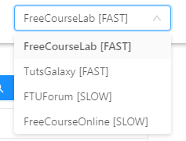

<p align="center">
  
</p>

<p align="center">
  
  
  
  
</p>

# Course Search

Desktop application built with React and Electron to find courses from multiple sources available to download in torrent form

### Download
https://github.com/burhanuday/course-search/releases


## Usage

- `win`: Download compiled executable from releases tab
- `mac`: Follow below steps to compile binary

### Changing Sources

<p align="center">
  
</p>
The source can be changed by picking a different website from the dropdown in the top right corner

### Compile Steps

```
git clone https://github.com/burhanuday/course-search
npm install
npm run package
```

- A new `dist` folder will be created in the root of your project containing the executable files
- NOTE: add `--mac` to the `postpackage` script besides `--win` if you are on a mac computer

## Development

- Run `npm start` to start the react development server
- After that, run `npm run start-electron` in a different terminal to start the electron app

## Project structure

- `electron/`: Code for the main Electron process
- `src/react/`: Code for the React renderer process
- `src/shared/`: Code shared between React and Electron
- `package.json`: Contains scripts for running the app in development, building it, and packaging it for production using electron-builder

## TODO

- Make an icon for the project
- Improve styling for the UI
- Add new sources

## Contributing

Make a new PR to contribute

## Boilerplate

Taken from https://github.com/burhanuday/electron-react-boilerplate

## License

GNU General Public License v3.0
